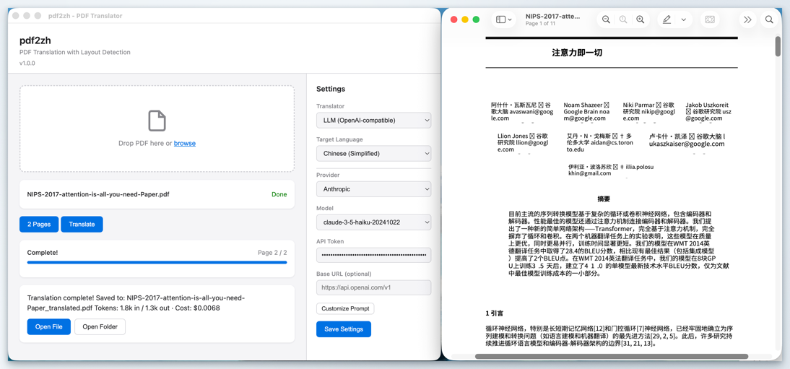

[English](README.md)

# pdf2zh-app

基于 AI 版面检测的桌面端 PDF 翻译工具，翻译后保留原文档排版。



## 功能特性

- **版面感知翻译** — 使用 DocLayout-YOLO (ONNX) 检测标题、正文、图表标题、表格和公式等区域，在保留原始排版的同时覆盖翻译文本
- **多种翻译引擎** — 支持 Google 翻译（免费，无需 API 密钥）或基于 LLM 的翻译，包括 OpenAI、Anthropic、Google、Mistral、Ollama 及任何 OpenAI 兼容接口
- **页面选择** — 预览页面缩略图，选择需要翻译的页面

## 下载

从 [Releases 页面](https://github.com/liunuozhi/pdf2zh-app/releases) 获取最新版本。

## 使用方法

1. **打开 PDF** — 将文件拖放到应用窗口，或点击"browse"选择文件
2. **选择页面** *（可选）* — 点击"Select Pages"通过缩略图预览选择特定页面
3. **配置** — 选择翻译引擎（Google 或 LLM），设置目标语言，如使用 LLM 需填写 API 密钥
4. **翻译** — 点击"Translate"，等待进度条完成。翻译后的 PDF 保存在原文件旁边

## LLM 支持

| 提供商 | 默认模型 |
|--------|----------|
| OpenAI | gpt-4o-mini |
| Anthropic | Claude |
| Google | Gemini |
| Mistral | Mistral |
| Ollama | 本地模型 |
| 自定义 | 任何 OpenAI 兼容 API |

可在设置面板中自定义翻译提示词。

## 从源码构建

```bash
git clone https://github.com/liunuozhi/pdf2zh-app.git
cd pdf2zh-app
npm install
npm start
```

创建可分发安装包：

```bash
npm run make
```

## 致谢

本项目受 [PDFMathTranslate](https://github.com/PDFMathTranslate/PDFMathTranslate) 启发。

## 许可证

[Apache-2.0](LICENSE)
